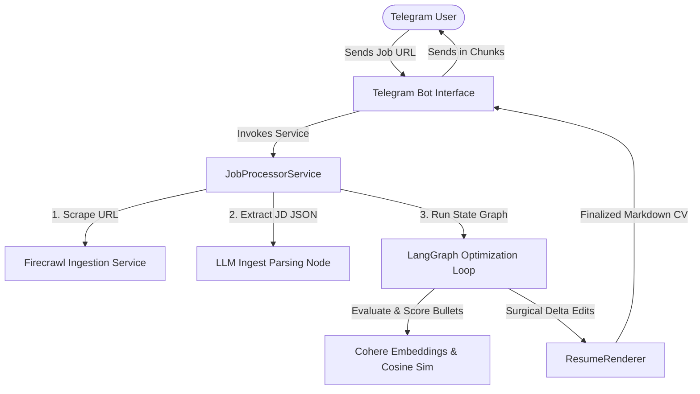

# AI Resume Tailor Bot

An asynchronous, production-grade resume optimization system designed to transform a candidate's master resume to align with the requirements of specific job postings. Operating as a Telegram Chatbot and a headless REST API, the system parses job URLs, conducts multi-agent semantic evaluation, adjusts resume bullet points, and verifies ATS keyword alignment in a tight self-healing loop.



---

## 🚀 Key Engineering Features

- **Multi-Agent Stateful Graph Loop**: Engineered with **LangGraph** (`@langchain/langgraph`) to model resume optimization as an iterative state machine (`jdIntelligence` -> `relevanceRanker` -> `bulletOptimizer` -> `computeScores` -> `decision`), enabling dynamic feedback loops and self-healing bullet optimizations.
- **Preservation-First Optimization**: Implements strict surgical edit rules. If an LLM-proposed change degrades the technical depth, simplifies complex software engineering achievements, or introduces non-factual fluff, the engine rejects the change and preserves the candidate's original text.
- **Mathematical Semantic Alignment**: Computes mathematical cosine similarities using **Cohere** `embed-english-v3.0` vectors to score proposed resume bullets against high-signal job description targets.
- **LLM-in-the-Loop Realism Audits**: Performs dynamic plausibility evaluations using separate LLM passes to verify domain compatibility and prevent "semantic contamination" (e.g. forcing finance terminology into a robotics project).
- **Stateless Architecture**: Operates completely in-memory using LangGraph State Annotations, reading master templates directly from static filesystem files (`masterResume.md`/`masterResume.json`), resulting in zero database transaction overhead and high horizontal scalability.
- **Robust Ingestion Pipeline**: Leverages **Firecrawl API** to crawl javascript-heavy job postings, clean layout artifacts, and convert them to raw markdown before extracting structured JSON parameters.
- **REST & Chat Client Entry**: Operates both as a responsive Telegram bot (`node-telegram-bot-api`) and as a headless Express REST API (`POST /api/process-job`), allowing easy integration with custom web dashboards (React, Next.js).

---

## 🛠️ Technology Stack

- **Runtime & Language**: Node.js, TypeScript (`tsx`, `ts-node`)
- **API Server Layer**: Express.js, Helmet, CORS, Express-Rate-Limit
- **AI Orchestration**: LangGraph (`@langchain/langgraph`), LangChain Core
- **Semantic Intelligence**: Cohere AI SDK (`embed-english-v3.0`, `rerank-english-v3.0`)
- **LLM Inference**: Groq Cloud SDK (Llama 3.1 8B) or local Ollama instances
- **Web Scraping**: Firecrawl JS SDK
- **Input Validation**: Zod schemas
- **Logging & Monitoring**: Winston console and file logs

---

## 📂 Codebase Blueprint

```text
src/
├── ai/
│   ├── cohereService.ts       # Semantic embeddings, cosine similarities, and rerankers
│   └── inferenceService.ts    # Dynamic routing to Groq or local Ollama with JSON-enforcement
├── config/
│   └── env.ts                 # Strong configuration validation via Zod schemas
├── controllers/
│   └── apiController.ts       # Express router controllers and bot webhook receivers
├── firecrawl/
│   └── firecrawlService.ts    # External crawler client converting job URLs to markdown
├── logs/
│   └── logger.ts              # Winston structured error and activity logs
├── middleware/
│   ├── errorHandler.ts        # Global exception and Zod validation interceptor
│   └── rateLimiter.ts         # Standard express-rate-limit settings
├── prompts/
│   └── jdPrompts.ts           # System-level prompts for JD parsing and resume tailoring
├── resume/
│   ├── masterResume.json      # Structured candidate profile reference
│   ├── masterResume.md        # Plain text source resume containing formatting targets
│   ├── resumeParser.ts        # Modular blocks separator extracting bullets
│   ├── resumeRenderer.ts      # Structured sections markdown compiler
│   ├── tailoringEngine.ts     # Main orchestrator initiating the LangGraph instance
│   └── tailoringGraph.ts      # Core LangGraph pipeline, nodes, evaluation thresholds
├── routes/
│   └── index.ts               # REST endpoints router definition
├── telegram/
│   └── bot.ts                 # Telegram Bot instance, event loop, message paging
├── app.ts                     # Express App initialization and server bindings
```

---

## ⚙️ Quick Start Local Installation

### 1. Install Dependencies
Ensure you have Node.js `v20+` installed:
```bash
npm install
```

### 2. Configure Environment variables
Duplicate `.env.example` to create your local configurations file:
```bash
cp .env.example .env
```

Open `.env` and fill in the required keys:
```text
PORT=3000
NODE_ENV=development
TELEGRAM_BOT_TOKEN=your_telegram_bot_token
FIRECRAWL_API_KEY=your_firecrawl_api_key
COHERE_API_KEY=your_cohere_api_key
GROQ_API_KEY=your_groq_api_key
```

### 3. Launch Development Server
Start the Express server and launch the Telegram bot in development polling mode:
```bash
npx tsx src/app.ts
```

---

## 🧪 Verification & Testing

### A. Testing via REST HTTP curl
You can trigger the tailoring pipeline directly without going through the Telegram client. Use `curl` to hit the local endpoint:

```bash
curl -X POST http://localhost:3000/api/process-job \
     -H "Content-Type: application/json" \
     -d '{"url":"https://example.com/job-posting-url"}'
```

### B. Testing the Telegram Chat Interface
1. Register a bot username with Telegram's **BotFather** and add the token to your `.env` file.
2. Search for your bot in the Telegram app and send `/start`.
3. Paste a job posting URL (e.g. LinkedIn or Indeed). The bot will reply with status updates and send back the tailored resume in chunks.

---

## 🗺️ Engineering Documentation Index

For an in-depth understanding of the architecture, systems design, and configurations, refer to the documents in the `/docs` folder:

- **[docs/INDEX.md](file:///c:/SatyamsFolder/projects/MERN/job-bot/docs/INDEX.md)**: The central catalog connecting all resources.
- **[System Overview](file:///c:/SatyamsFolder/projects/MERN/job-bot/docs/SYSTEM_OVERVIEW.md)**: Product value models, system block diagrams, and technology breakdowns.
- **[Architecture Map](file:///c:/SatyamsFolder/projects/MERN/job-bot/docs/ARCHITECTURE_MAP.md)**: Layered architectures, code layouts, import dependencies, and contract signatures.
- **[LangGraph & AI Pipelines](file:///c:/SatyamsFolder/projects/MERN/job-bot/docs/ai.md)**: Graph nodes details, mathematical scoring formulas, and validation heuristics.
- **[REST API Reference](file:///c:/SatyamsFolder/projects/MERN/job-bot/docs/api.md)**: Request/Response JSON payload schemas and validation error maps.
- **[Architectural Decisions (ADRs)](file:///c:/SatyamsFolder/projects/MERN/job-bot/docs/decisions.md)**: Context, trade-offs, and consequences for LangGraph state machine iterations and stateless configurations.
- **[Deployment Guide](file:///c:/SatyamsFolder/projects/MERN/job-bot/docs/deployment.md)**: Process management setups (PM2), running modes (polling vs webhooks), and rate-limit scaling plans.
