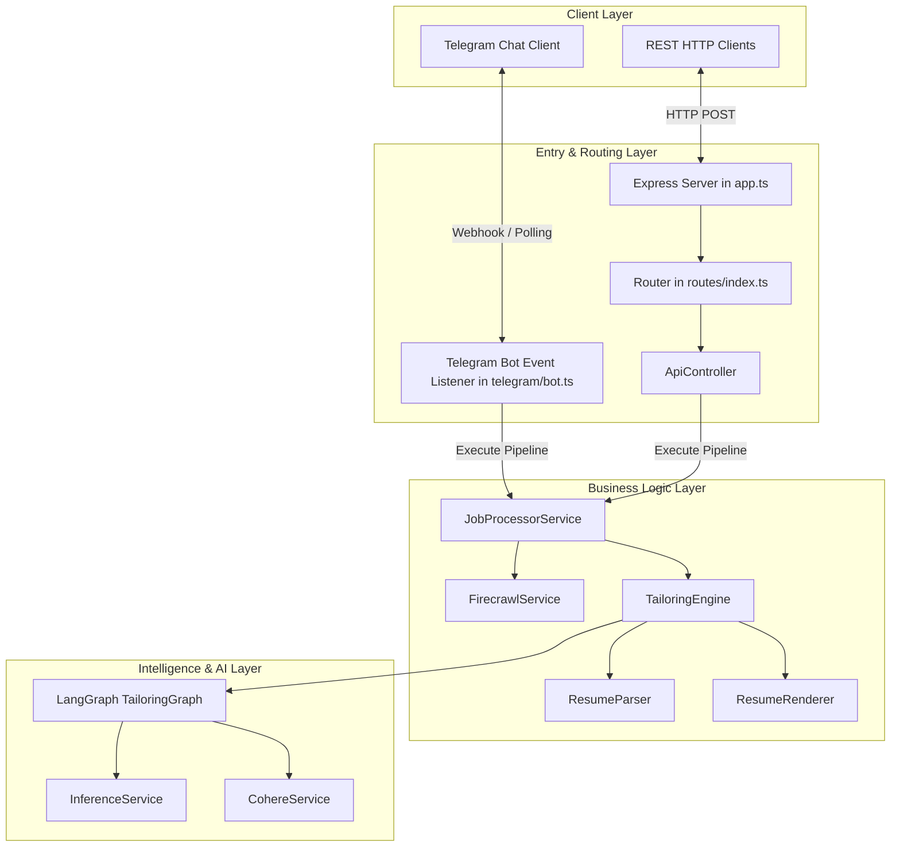
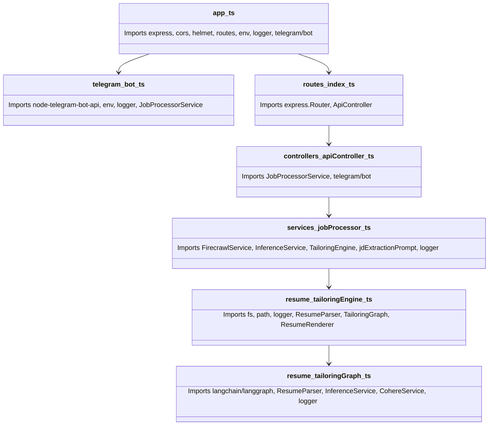

# Architecture Map - Module Dependency & Boundary Map

This document maps out the system's architecture, including imports, file dependencies, interfaces, and specific layer boundaries.

---

## 1. Directory Blueprint & Module Responsibilities

The codebase uses a highly modular structure. The main directory tree and files are organized as follows:

```text
src/
├── ai/
│   ├── cohereService.ts       # Semantic embeddings, cosine similarities, and document reranking
│   └── inferenceService.ts    # Dynamic routing to Groq or local Ollama with JSON-enforcement
├── config/
│   └── env.ts                 # Strong configuration validation via Zod schemas
├── controllers/
│   └── apiController.ts       # Web webhook and API routing actions
├── firecrawl/
│   └── firecrawlService.ts    # External crawler client converting job URLs to markdown
├── logs/
│   └── logger.ts              # Winston structured error and activity logs
├── middleware/
│   ├── errorHandler.ts        # Global error interceptor handling Zod and standard errors
│   └── rateLimiter.ts         # Standard express-rate-limit settings
├── prompts/
│   └── jdPrompts.ts           # System-level prompts for JD parsing and resume tailoring
├── resume/
│   ├── masterResume.json      # Structured candidate profile reference
│   ├── masterResume.md        # Plain text source resume containing formatting targets
│   ├── resumeParser.ts        # Modular blocks separator extracting bullets
│   ├── resumeRenderer.ts      # Structured sections markdown compiler
│   ├── tailoringEngine.ts     # Main orchestrator initiating the LangGraph instance
│   └── tailoringGraph.ts      # Core LangGraph pipeline, nodes, evaluation thresholds
├── routes/
│   └── index.ts               # Express Router mounting API controllers and handlers
├── telegram/
│   └── bot.ts                 # Telegram Bot instance, event loop, message paging
├── app.ts                     # Express App initialization and server bindings
```

---

## 2. Layered Architecture Boundaries

The application is structured into four clearly defined conceptual layers, ensuring separation of concerns:



### Layer Rules & Isolation:
1. **Zero Database Direct Binding**: Data stays in-memory. State modifications during optimization are recorded inside the LangGraph `State` annotation variables and metadata objects.
2. **Deterministic Schemas**: All interactions with LLMs must pass through either Zod validator parses (`env.ts`) or standard schema structures (`jdExtractionPrompt`).
3. **No Direct Inference from Ingestion Layer**: The scraper (`FirecrawlService`) has zero awareness of the LLMs or LangGraph; it merely collects raw markdown assets.

---

## 3. Dependency Matrix & Import Graph

The diagram below maps the internal module imports to show how modules are coupled across the codebase:



---

## 4. Component Interface Contracts

Below are the input and output signatures of the critical boundary components of the system:

| Component File | Invoker | Input Signature | Output Signature |
| :--- | :--- | :--- | :--- |
| **`FirecrawlService`** | `JobProcessorService` | `url: string`, `maxRetries?: number` | `Promise<string>` (Scraped Markdown content) |
| **`InferenceService`** | `JobProcessorService`, `TailoringGraph` | `prompt: string`, `maxRetries?: number` | `Promise<string>` or `Promise<any>` (Parsed JSON structures) |
| **`CohereService`** | `TailoringGraph` (Compute Scores Node) | `texts: string[]` (Embeddings) / `query: string`, `documents: string[]` (Reranking) | `Promise<number[][]>` / `Promise<{ index: number, relevanceScore: number }[]>` |
| **`ResumeParser`** | `TailoringEngine` | `markdown: string` (Raw Master Resume text) | `{ header: string[], experience: ParsedProject[], projects: ParsedProject[], skills: string[], footer: string[] }` |
| **`TailoringGraph`** | `TailoringEngine` | `initialState: State` (Contains parsed resume, raw job description JSON, initial metadata state) | `Promise<State>` (Contains optimized lists and scoring matrices) |
| **`ResumeRenderer`** | `TailoringEngine` | `experience: ParsedProject[]`, `projects: ParsedProject[]`, `skills: string[]` | `string` (A beautifully combined Markdown resume containing ONLY whitelisted sections) |
