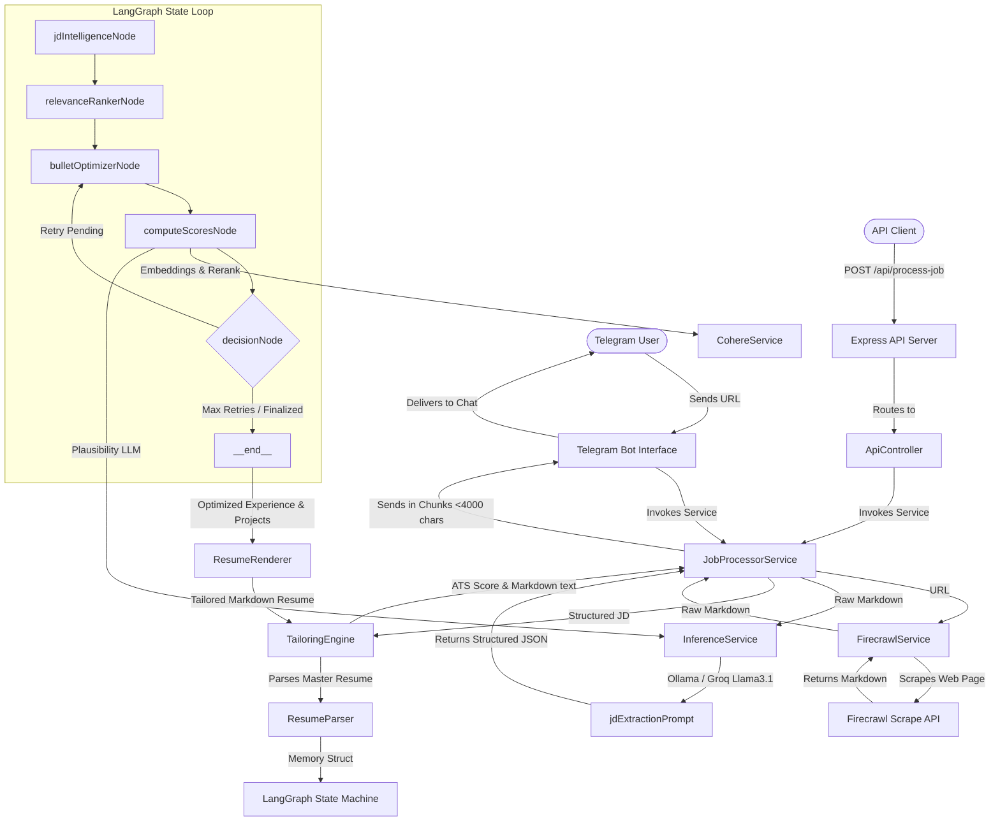

# System Overview - AI Resume Tailor Bot

The **AI Resume Tailor Bot** is a production-grade, asynchronous resume optimization system designed to transform a candidate's master resume to align precisely with the requirements of a specific job posting. Operating as a Telegram Chatbot and stateless REST API, the system eliminates manual CV tuning by programmatically parsing job postings, conducting multi-agent semantic evaluation, surgically adjusting resume bullet points, and verifying ATS keyword density in a tight feedback loop.

---

## 1. Core Value Proposition & System Goal

Modern Applicant Tracking Systems (ATS) filter out candidates using semantic similarity matching and keyword checkmarks. Standard LLM-based resume generation typically fails because:
1. **Hallucination & Fabrication**: Generative models invent domain claims or past roles that the candidate never held.
2. **Loss of Technical Depth**: LLMs often simplify complex engineering descriptions during rewrites to fit standard templates.
3. **Format Degradation**: Automated systems break clean Markdown styles, leading to messy, unreadable documents.

The AI Resume Tailor Bot solves this through a **Preservation-First, Multi-Agent Optimization Loop** implemented with **LangGraph**:
- **Surgical Delta Edits**: Rather than writing a resume from scratch, the system acts as a layout-aware text editor, replacing only high-impact keywords and project priorities, strictly preserving the original engineering density.
- **Section Whitelisting**: Emits only high-impact sections (`Experience`, `Projects`, `Technical Skills`) to optimize ATS scoring profiles while stripping generic, low-signal summaries or contact info.
- **Multi-Agent Evaluation**: Uses an LLM agent paired with Cohere embedding models to compute mathematical semantic alignment, filtering out changes that fail strict tone, conciseness, or realism thresholds.

---

## 2. Technology Stack Matrix

The system is constructed with a modern, high-performance Node.js and TypeScript runtime and leverages elite AI/ML libraries:

| Layer | Technology | Version | Purpose / Selection Rationale |
| :--- | :--- | :--- | :--- |
| **Runtime & Language** | Node.js / TypeScript | `Node v20+` / `TS v6.0` | Provides strict typing and async performance needed for fast network polling and LLM processing. |
| **API Server Layer** | Express.js | `v5.2.1` | Lightweight HTTP server exposing webhooks and diagnostic endpoints. |
| **AI Orchestration** | LangGraph (`@langchain/langgraph`) | `v1.3.2` | Models the iterative optimization, scoring, and retry nodes as a stateful graph. |
| **Semantic Intelligence** | Cohere AI SDK | `v8.0.0` | Computes semantic similarity (using `embed-english-v3.0`) and reranks vectors (using `rerank-english-v3.0`). |
| **LLM Inference** | Groq SDK / Ollama | `groq-sdk v1.2` | Routes to cloud-based Groq (Llama 3.1 8B) or local Ollama instances for low-latency structured extraction. |
| **Web Scraping** | Firecrawl JS SDK | `v4.25.0` | Converts Javascript-heavy job application web pages into raw Markdown layout cleanly. |
| **Input Validation** | Zod | `v4.4.3` | Enforces runtime strict typing of system environment configurations and LLM outputs. |
| **Logging & Monitoring** | Winston | `v3.19.0` | Structured logging to files (`logs/error.log`, `logs/combined.log`) and standard output. |
| **Security Suite** | Helmet / CORS / Express-Rate-Limit | `Helmet v8.2` / `Rate-Limit v8.5` | Hardens REST endpoints against brute force, cross-origin scripting, and API pollution. |

---

## 3. High-Level Modular Architecture

The system operates across three separate boundaries:
1. **Client Interface**: The Telegram Bot API and standard REST endpoints capture job URLs and dispatch asynchronous processing.
2. **Ingestion Pipeline**: Firecrawl crawls and converts the target web resource into raw markdown, which is then parsed by the LLM into a highly structured JSON representation.
3. **LangGraph Optimization Loop**: Executes state transitions that iteratively adapt, evaluate, score, and finalize optimized resume points.

---

## 4. Operational Boundaries

- **Stateless Execution**: The application holds no persistent database connections (MongoDB or PostgreSQL). Master resumes are read from the filesystem (`masterResume.md`), and state transitions happen entirely in-memory using LangGraph state annotations during a single execution block.
- **Resource Constraints**: Leverages a 1.5-second pacing delay inside the LLM retry mechanism to strictly respect Groq TPM (Tokens Per Minute) and RPM (Requests Per Minute) boundaries.
- **Client Integration**: The bot initializes in standard polling mode under development and seamlessly scales to Webhook routing (`/api/telegram/webhook`) behind reverse proxies in staging and production.
