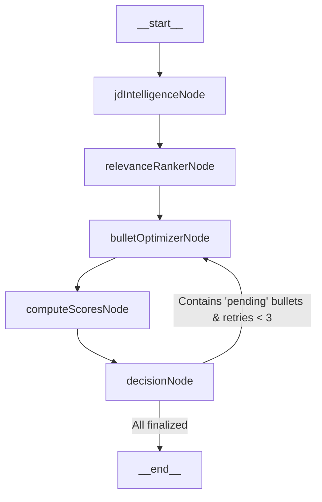

# AI Architecture - LangGraph, Cohere, & LLM Inferences

The AI layer is the core of the **AI Resume Tailor Bot**. It coordinates external large language models (LLMs) and vector embeddings to optimize, evaluate, and sanitize resume points iteratively.

---

## 1. LLM Ingest Routing (Groq vs Ollama)

The `InferenceService` handles querying the LLM and dynamically routes traffic based on your environment configuration:

- **Local Inference (Ollama)**: Triggered if `OLLAMA_MODEL` is set. Standard payload parameters use a low temperature (`0.2`) and enforce JSON structures:
  - `format: "json"`
  - Enforces JSON output deterministically.
- **Cloud Inference (Groq SDK)**: Utilized if `GROQ_API_KEY` is present. Enforces JSON output using Groq's JSON mode:
  - `response_format: { type: 'json_object' }`
- **TPM/RPM Protection**: Includes an automated `1.5-second` delay before retry execution to respect Groq's TPM limits and prevent rate limit exceptions.

---

## 2. Core Prompt Pipelines

### A. JD Extraction Prompt (`jdExtractionPrompt`)
Instructs the model to parse raw markdown into structured JSON:

```json
{
  "company": "string",
  "role_title": "string",
  "seniority": "string (e.g., Junior, Mid, Senior)",
  "type": "string (e.g., Internship, Full-time, Contract)",
  "location": "string",
  "work_model": "string (Remote, Hybrid, On-site)",
  "required_skills": ["string"],
  "preferred_skills": ["string"],
  "technologies": ["string"],
  "ats_keywords": ["string"],
  "responsibilities": ["string"],
  "qualifications": ["string"],
  "hidden_expectations": ["string"],
  "engineering_culture": "string",
  "emphasis": "string (e.g., Backend, Frontend, Fullstack, AI)",
  "hiring_signals": ["string"]
}
```

### B. Precision Resume Optimizer Instructions (`resumeTailoringPrompt`)
Enforces preservation rules during rewrites:
- **Strict Section Whitelisting**: Only Experience, Projects, and Technical Skills are processed. Contact details, summary cards, and education are excluded.
- **Preservation-First**: Retains the original bullet point if the rewrite degrades technical depth or simplifies complex architectural phrasing.
- **Strict Format Preservation**: Preserves original section names, order, formatting, and spacing rules.
- **Minimal surgical edits**: Restricts editing to swapping 1-2 key terms (aiming for $\pm$10-15% word count variance).

---

## 3. LangGraph Orchestration Deep-Dive

The `TailoringGraph` organizes five functional nodes into a stateful, cyclic workflow.



### LangGraph State State (`GraphState`)
Maintains the context of the execution:
- `parsedResume`: Parsed section mappings from `ResumeParser`.
- `jobDescription`: Structured JSON output of the target job description.
- `jdEmphasis`: Key terms, domains, and targets extracted from the job description.
- `optimizedExperience`: Array of experience projects under review.
- `optimizedProjects`: Array of projects under review.
- `metadata`: Optimization metadata and scores mapped by bullet ID.

### Detailed Node Execution:

#### 1. `jdIntelligenceNode`
- **Role**: Analyzes the structured JD JSON to identify core semantic keywords, target domains, and concepts.
- **Outputs**: Sets `jdEmphasis` to guide the optimizer (defaulting to `['software engineering']` on failure).

#### 2. `relevanceRankerNode`
- **Role**: Maps the initial metadata states (`OptimizationMetadata`) for every project and experience bullet point.
- **State Initialization**:
  ```typescript
  metadata[bullet.id] = {
    bullet_id: bullet.id,
    original: bullet.originalText,
    optimized: bullet.originalText,
    ats_gain_score: 0,
    semantic_similarity_score: 1.0,
    authenticity_score: 1.0,
    domain_compatibility_score: 1.0,
    engineering_tone_score: 1.0,
    conciseness_score: 1.0,
    optimization_confidence_score: 0,
    retry_count: 0,
    final_decision: "pending"
  };
  ```

#### 3. `bulletOptimizerNode`
- **Role**: Invokes LLM processes to adapt "pending" bullets to the target JD constraints.
- **Rules Enforced**:
  - Requires diverse, active verbs (Architected, Developed, Implemented, Designed, Optimized, Secured).
  - **No starting verb repetition**: Ensures no two bullets in the same experience section begin with the same verb.
  - Banishes empty filler words (e.g. leveraging, utilizing).
  - Enforces strict domain limits to prevent "semantic contamination" (e.g., prevents adding financial keywords to a computer vision project).

#### 4. `computeScoresNode`
- **Role**: Computes semantic and structural alignment scores:
  - **Vector Embeddings**: Calls Cohere `embed-english-v3.0` to calculate vector embeddings for the original bullet, optimized bullet, and target JD.
  - **Mathematical Cosine Similarity**:
    $$\text{Cosine Similarity} = \frac{\vec{A} \cdot \vec{B}}{\|\vec{A}\| \|\vec{B}\|}$$
  - **ATS Semantic Gain**: Measures the increase in cosine similarity relative to the target JD:
    $$\text{ATS Gain} = \min((\text{Similarity}_{\text{optimized, JD}} - \text{Similarity}_{\text{original, JD}}) \times 5, 1.0)$$
  - **Plausibility Review**: Executes an LLM-in-the-loop realism evaluation using a custom prompt to check for domain contamination.
  - **Authenticity / Fluff Penalties**: Subtracts `0.5` points if generic soft-skill words (e.g., communication, leadership, teamwork) are introduced.
  - **Conciseness Penalties**: Subtracts `0.3` points if filler verbs (e.g. leveraging, utilizing) are added, and penalizes length increases of more than 12 words.
  - **Engineering Tone**: Checks for strong systems verbs (built, designed, developed, architected, optimized), applying a `0.1` penalty if none are found.

#### 5. `decisionNode`
- **Role**: Evaluates the metrics against strict thresholds:
  - **Domain Compatibility**: `>= 0.8`
  - **Semantic Similarity**: `>= 0.85` (ensures semantic preservation)
  - **Authenticity**: `>= 0.8`
  - **Conciseness**: `>= 0.7`
  - **Engineering Tone**: `>= 0.8`
  - **ATS Gain**: Must be positive (`> 0`) unless similarity is extremely high (`>= 0.98`), in which case minor formatting tweaks are accepted.
- **Self-Correction & Fallbacks**:
  - If a change fails a threshold and `retry_count < 3`, `final_decision` resets to `pending` to trigger another iteration in the graph.
  - If it fails and `retry_count === 3`, the changes are discarded, and the engine **preserves** the original text.
  - If all thresholds are met, the bullet state is marked **optimized**.

---

## 4. Optimization Confidence Score Formula

The overall quality of a change is evaluated using a weighted confidence formula:

$$\begin{aligned}
\text{Optimization Confidence} = & \ (\text{Semantic Similarity} \times 0.25) \\
& + (\text{Authenticity Score} \times 0.25) \\
& + (\text{Domain Compatibility} \times 0.20) \\
& + (\text{Engineering Tone} \times 0.15) \\
& + (\text{Conciseness Score} \times 0.10) \\
& + (\text{ATS Gain} \times 0.05)
\end{aligned}$$

This ensures that preserving the candidate's original text, maintaining domain realism, and active tone are highly prioritized over simple keyword stuffing.
