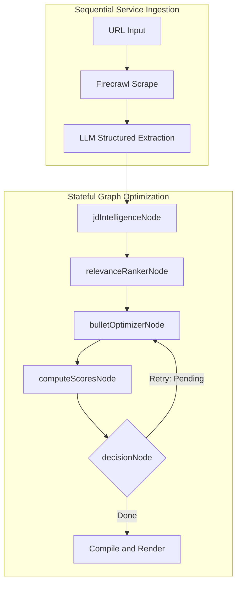
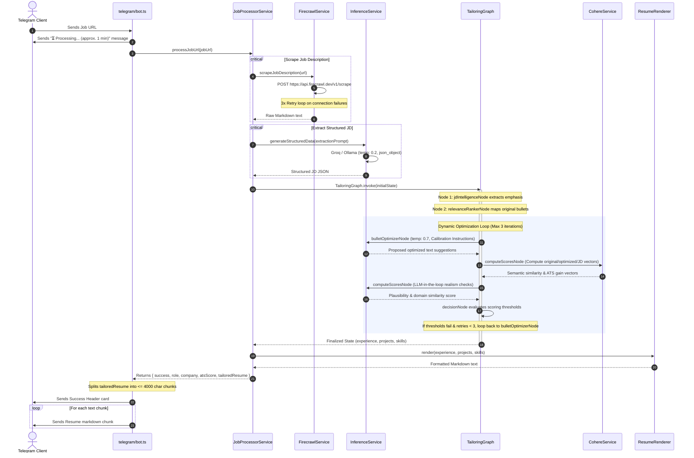

# System Architecture - In-Depth Review

This document provides a deep, technical breakdown of the system design, layered boundaries, orchestration patterns, scaling considerations, and request-response lifecycles of the **AI Resume Tailor Bot**.

---

## 1. Architectural Orchestration Patterns

The system divides orchestration into two distinct paradigms: **Sequential Service Orchestration** (Ingestion Pipeline) and **Stateful Graph Orchestration** (Optimization Pipeline).

### A. Sequential Service Orchestration (`JobProcessorService`)
The entry pipeline is standard, linear execution:
1. **Scraping Ingestion**: Calls `FirecrawlService.scrapeJobDescription` asynchronously to turn a URL into clean Markdown.
2. **Structural Sanitization**: Feeds raw markdown to `InferenceService.generateStructuredData` using `jdExtractionPrompt` to extract a structured JSON payload of the Job Description (JD).
3. **Trigger Tailoring Engine**: Initializes a new `TailoringEngine` instance and executes `tailorResume(structuredJd)`.

### B. Stateful Graph Orchestration (`TailoringGraph` via LangGraph)
Once the unstructured ingestion finishes, the pipeline switches to a stateful, iterative state machine powered by `@langchain/langgraph`:
- State transitions are managed using standard LangGraph `State` attributes (`GraphState.State`), retaining references to the parsed sections of the resume and scoring metadata.
- Using a graph allows **dynamic feedback loops** and **self-correction**. If a bullet point optimization degrades the technical quality or inserts non-factual fluff, the graph loops back to re-optimize that specific bullet up to 3 times before falling back to the original text.

---

## 2. Comprehensive Request-Response Lifecycle

Here is the exact journey of a request from client initiation to result delivery:

---

## 3. Rendering Pipeline & Spacing Architecture

The **`ResumeRenderer`** acts as a compiler translating structured parsed nodes back into a unified plain-text markdown file:
- **Strict Whitelisting**: Only the whitelisted sections (`Experience`, `Projects`, `Technical Skills`) are output. Sections like contact info, objectives, education, and achievements are stripped from the final tailoring, optimizing keyword real estate for ATS evaluations.
- **Normalization**:
  - Unescapes literal `\n` and `\\n` inputs returned from the LLM JSON objects.
  - Ensures every bullet point is strictly prefix-normalized with `• ` (bullet plus single space), fixing occurrences of direct strings like `•Bullet Text` or missing bullet indicators.
  - Generates clear, single empty line margins between experience and project items to maintain standardized layout rules.

---

## 4. Scaling Considerations & System Tradeoffs

### A. Stateless Execution (Pros & Cons)
- **Tradeoff**: Running without databases (MongoDB, PostgreSQL) means the application cannot persist historical outputs or save user-customized master resumes directly via the bot interface.
- **Pros**: Extreme horizonal scalability. The bot has zero database connection limits, uses almost zero filesystem writes (only Winston log appending), and can run on ephemeral architectures like AWS Lambda or Google Cloud Run.

### B. Rate Limits & LLM Bottlenecks (TPM/RPM Strategies)
Because LangGraph executes recursive optimization across multiple bullets in a loop, it hits LLM provider endpoints frequently.
- **Pacing**: A `1.5-second` delay is hardcoded inside `InferenceService` on retry paths to protect the application from hitting Groq standard Tokens Per Minute (TPM) limits.
- **Failover routing**: If cloud keys are exhausted, configuring `OLLAMA_MODEL` instantly redirects load locally, providing a stable fall-back layer.
- **Local host caching**: While Redis is not currently active, `REDIS_URL` is parsed at environment validation. A caching layer should be introduced to save scraped job postings to avoid repetitive external network latency.
