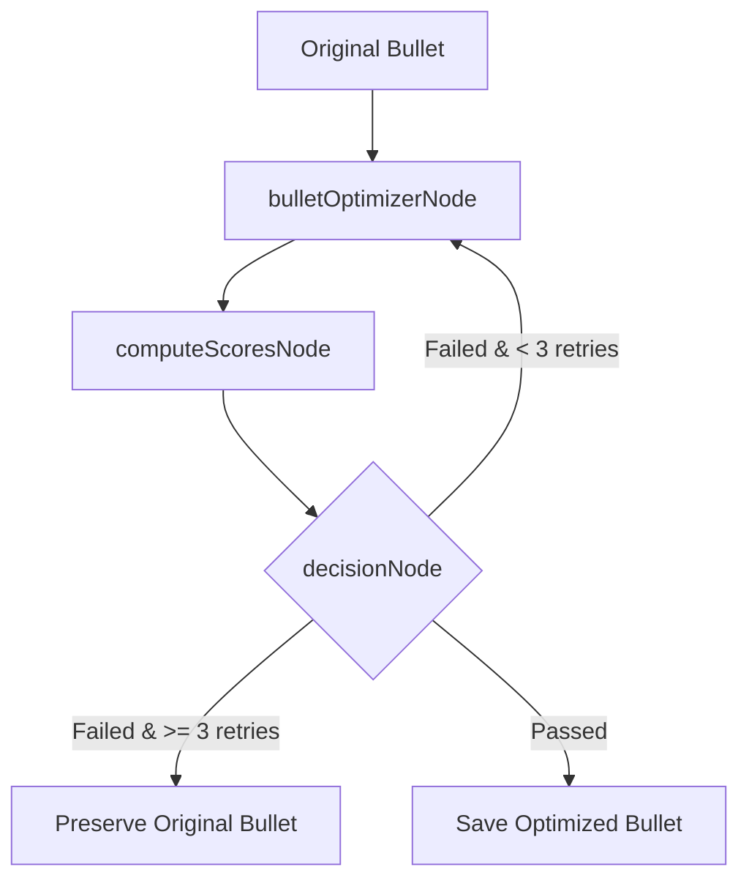

# Architectural Decision Records (ADRs)

This document contains the Architectural Decision Records (ADRs) for the **AI Resume Tailor Bot**, detailing the design decisions, trade-offs, and technologies selected for the project.

---

## ADR-001: LangGraph Iterative Loop vs. Single-Shot LLM Prompts

### Status
**Approved**

### Context
Standard resume optimization attempts to tailor a candidate's resume in a single prompt. While faster, this single-shot approach often suffers from several issues:
1. **Hallucination**: The model frequently invents experience details or past roles that the candidate never held.
2. **Technical Simplification**: In trying to align with the job description, the model often simplifies complex technical descriptions, degrading the resume's overall technical depth.
3. **Format Loss**: Generating a complete resume from scratch often breaks clean markdown formatting.

### Decision
We chose to implement a stateful, iterative multi-agent graph loop using **LangGraph** (`@langchain/langgraph`). 

The optimization process is divided into separate graph nodes (`jdIntelligence` -> `relevanceRanker` -> `bulletOptimizer` -> `computeScores` -> `decision`):
- Optimization targets are evaluated bullet-by-bullet.
- Proposed optimizations are evaluated against strict thresholds using Cohere vector embeddings and LLM-in-the-loop realism checks.
- If a change fails to improve the resume or degrades its quality, the graph loops back to re-optimize up to 3 times before falling back to the original text.

### Consequences
- **Pros**: Ensures high-quality, realistic, and highly optimized resume bullet points that preserve the candidate's original technical accomplishments.
- **Cons**: Increased execution latency (~1 minute per run) and higher API token consumption due to the iterative optimization and scoring loops.

---

## ADR-002: Stateless Execution vs. Database Persistence

### Status
**Approved**

### Context
Standard web applications store user states, settings, and generated histories in a persistent database like MongoDB or PostgreSQL. However, adding database bindings introducing several overheads:
1. **Infrastructure complexity**: Requires provisioning, securing, and maintaining database servers.
2. **Scaling bottlenecks**: Introduces database connection limits, transaction locks, and IO write overheads.
3. **Data privacy concerns**: Storing personal resume data increases the security and regulatory compliance burden.

### Decision
We chose a **completely stateless architecture**:
- The candidate's master resume is read directly from static files on the server (`masterResume.md`/`masterResume.json`).
- Execution states are held entirely in-memory using LangGraph State Annotations during the lifecycle of the request.
- The system returns optimized files directly to the client without storing histories on server disks.

### Consequences
- **Pros**: High scalability, minimal memory footprint (<150MB RAM), and excellent fit for lightweight serverless hosting environments.
- **Cons**: Users cannot save custom resumes or view optimization histories directly through the Telegram bot interface.

---

## ADR-003: Telegram Chatbot as the Primary Client Interface

### Status
**Approved**

### Context
Building a custom web dashboard (using React or Vue) requires developing complex frontend layouts, state management systems, and authentication flows before users can interact with the product.

### Decision
We selected **Telegram** as the primary client interface:
- Eliminates the need to design a custom frontend dashboard.
- Telegram's native chat UI handles layouts, text inputs, error message rendering, and message styling out of the box.
- Users can easily interact with the bot from any device simply by sending a job URL.
- The Express backend retains a headless REST API endpoint (`POST /api/process-job`), allowing a custom frontend to be easily integrated in the future.

### Consequences
- **Pros**: Fast development cycle, instant multi-device compatibility, and zero frontend layout maintenance overhead.
- **Cons**: Limited to Telegram's UI capabilities and a 4096-character message limit, requiring the bot to split and send tailored resumes in chunks.
