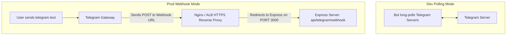

# Deployment & Infrastructure Guide

This document details the configuration steps, environment variables, hosting requirements, process configurations, and API scaling strategies for deploying the **AI Resume Tailor Bot** to production.

---

## 1. Complete Environment Variables Configuration

The application validates the following variables at boot using Zod. Create a `.env` file at the root of the project:

| Key | Type | Default Value | Description | Required in Production |
| :--- | :--- | :--- | :--- | :--- |
| `PORT` | Number | `3000` | Port the Express server listens on. | No |
| `NODE_ENV` | String | `development` | Running environment mode (`development`, `production`, `test`). | Yes |
| `TELEGRAM_BOT_TOKEN` | String | *None* | Unique API token generated by Telegram's BotFather. | **Yes** |
| `FIRECRAWL_API_KEY` | String | *None* | API key for Firecrawl.dev, used to scrape job URLs. | **Yes** |
| `GROQ_API_KEY` | String | *None* | API key for Groq Cloud. Optional if running local Ollama instead. | Optional |
| `GROQ_MODEL` | String | `llama-3.1-8b-instant` | Groq LLM model used for optimizations. | No |
| `OLLAMA_MODEL` | String | *None* | Local Ollama model name (e.g. `llama3`). Enables local routing. | Optional |
| `OLLAMA_BASE_URL` | String | `http://localhost:11434` | API URL for local Ollama instances. | No |
| `COHERE_API_KEY` | String | *None* | API key for Cohere, used for semantic similarity checks. | **Yes** |
| `REDIS_URL` | String | *None* | Redis connection string (e.g. `redis://localhost:6379`). | No |
| `TELEGRAM_WEBHOOK_URL`| String | *None* | Public domain URL for webhook registration in production. | **Yes** (if webhook is active) |

---

## 2. Infrastructure Requirements

- **Processor and RAM**: The application is highly efficient and stateless:
  - **Memory footprint**: Standard execution consumes less than `150MB` of RAM.
  - **CPU footprint**: Minimal CPU usage since processing is delegated to external AI services (Groq, Cohere, and Firecrawl).
  - Can be hosted on lightweight instances (e.g., AWS EC2 nano/micro, digitalocean $4 droplet, or serverless architectures like Google Cloud Run).
- **Network access**: The hosting environment must allow outgoing HTTPS requests to:
  - `https://api.telegram.org`
  - `https://api.firecrawl.dev`
  - `https://api.groq.com`
  - `https://api.cohere.com`
- **Compiler Toolchain Dependencies**: 
  - To enable automatic PDF generation, the **Tectonic compiler CLI** must be installed on your host system (or bundled in your Docker image) and accessible in your shell environment path (`tectonic`). 
  - On the first compilation run, Tectonic requires outbound internet access to download standard LaTeX styling packages from its package registry CDN. Subsequent runs will use locally cached assets.


---

## 3. Running Modes: Development Polling vs Production Webhook

The Telegram bot supports two connection modes, determined by the `NODE_ENV` environment variable:



- **Dev Polling Mode (`NODE_ENV=development`)**:
  - The bot opens a long-polling channel directly to Telegram's servers.
  - Useful for local development since it does not require a public HTTPS domain.
- **Prod Webhook Mode (`NODE_ENV=production`)**:
  - Requires `TELEGRAM_WEBHOOK_URL` to be configured.
  - The bot registers a webhook at `${TELEGRAM_WEBHOOK_URL}/api/telegram/webhook`.
  - Telegram sends new message notifications directly to your server via HTTPS POST requests, reducing latency and resource consumption.

---

## 4. Production Process Management (PM2)

In production, run the application as a background process using a process manager like **PM2** to handle automated crashes, log rotations, and server restarts.

### Example PM2 Configuration (`ecosystem.config.js`):
Create this file at the root of the project:

```javascript
module.exports = {
  apps: [
    {
      name: "job-bot",
      script: "./src/app.ts",
      interpreter: "node",
      // Execute typescript using tsx
      interpreter_args: "--import tsx",
      instances: 1, // Webhook mode requires single instance to avoid duplication
      exec_mode: "fork",
      env: {
        NODE_ENV: "production",
      },
      error_file: "./logs/pm2-error.log",
      out_file: "./logs/pm2-out.log",
      log_date_format: "YYYY-MM-DD HH:mm:ss Z",
    },
  ],
};
```

### PM2 Commands:
- Start the process: `pm2 start ecosystem.config.js`
- View application logs: `pm2 logs job-bot`
- Restart application: `pm2 restart job-bot`
- Monitor resource consumption: `pm2 monit`

---

## 5. Rate Limits & Token Scaling (TPM Strategies)

Because LangGraph iteratively optimizes multiple resume bullets in a loop, the application generates a high volume of concurrent API calls. This can quickly exhaust standard Groq Tokens Per Minute (TPM) limits:

1. **Inference pacing**: The `InferenceService` implements an automatic pacing delay. On typical connection failures, it waits `1.5 seconds` before retrying. However, if a **429 Rate Limit** or token limit is explicitly caught from the LLM provider, it dynamically scales the backoff delay to **3.0 seconds** to give the on-demand token bucket ample time to replenish.
2. **Local fallback routing**: Configure `OLLAMA_MODEL` to run optimizations locally. This provides unlimited inference capacity, bypassing external cloud rate limits entirely during high-traffic periods.
