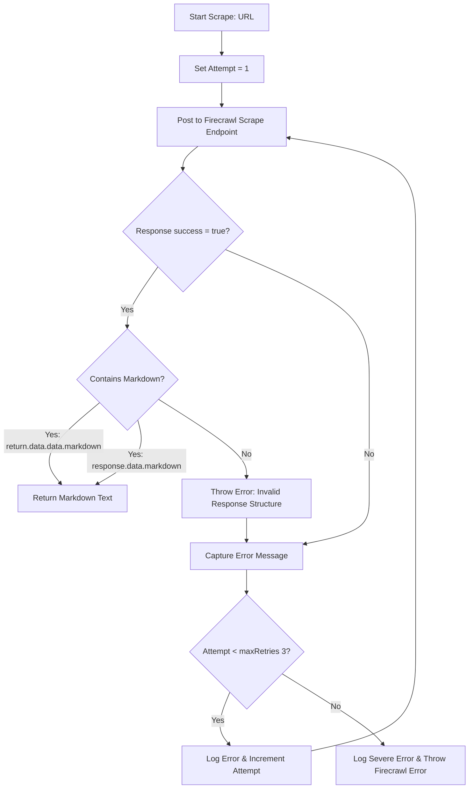
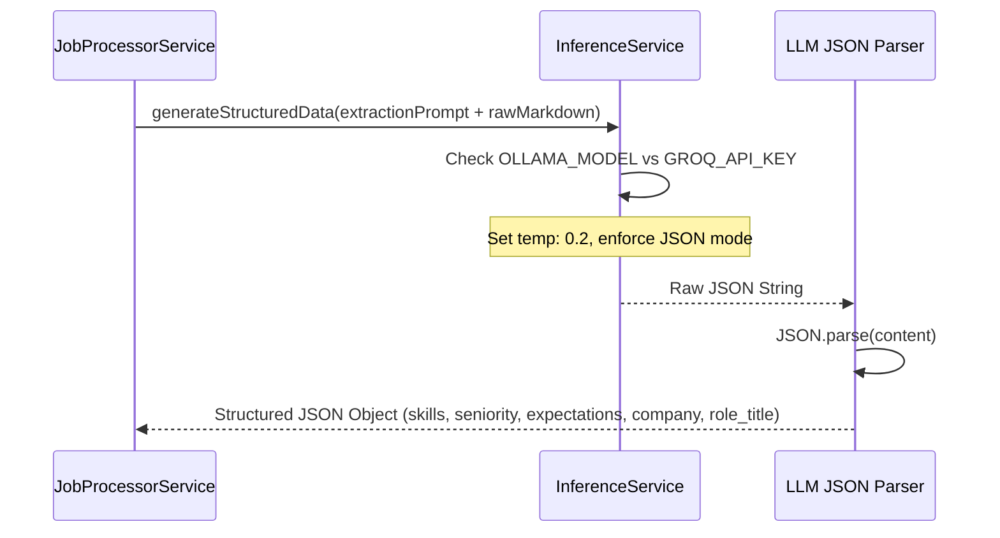
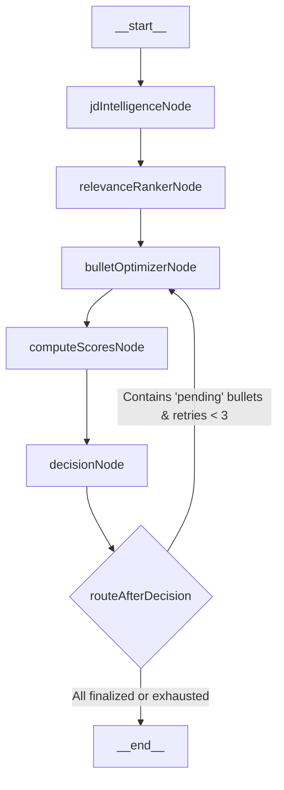
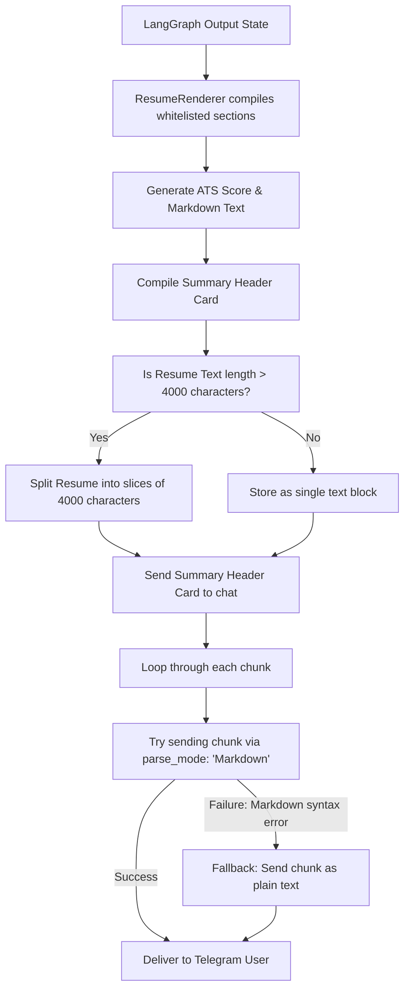
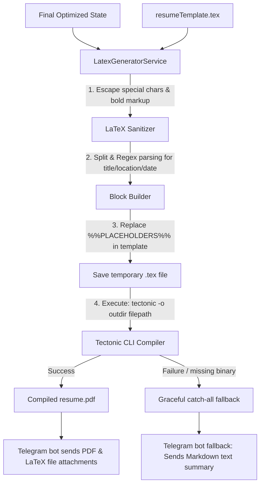

# System Flows - Sequential & Orchestration Workflows

This document outlines the step-by-step data and logic flows that occur inside the **AI Resume Tailor Bot**, covering scraping, semantic analysis, multi-agent LangGraph loops, scoring heuristics, and content chunking.

---

## 1. Web Scraping & Ingestion Flow (`FirecrawlService`)

This flow handles downloading external job descriptions. To manage dynamic web pages (SPAs), network variance, and API downtime, the system wraps its requests in an automated retry wrapper.

### Steps:
1. **Initiate Request**: The bot receives a URL, acknowledging it to the user before calling `scrapeJobDescription(url)`.
2. **Execute Scraper API**: Standard `axios.post` is directed to `https://api.firecrawl.dev/v1/scrape` with target headers (`Authorization: Bearer FIRECRAWL_API_KEY`) and options forcing the format to `markdown`.
3. **Parse Markdown Payload**: Checks both nesting structures: `response.data.data.markdown` (Standard Firecrawl SDK format) and fallback `response.data.markdown` to extract clean markdown text.
4. **Retry Loop**: Up to 3 attempts are executed. On failure, the connection exception is logged, and the loop retries instantly. If all 3 attempts fail, an explicit error is thrown back to `JobProcessorService`.

---

## 2. JD Extraction & Semantic Analysis

Once raw Markdown is fetched, the pipeline extracts the critical core targets from it.

### Steps:
1. **Assemble Prompt**: The raw scraped markdown is appended to `jdExtractionPrompt` which defines a strict JSON output schema.
2. **Query Inference**: The prompt is processed with a low temperature of `0.2` to minimize LLM creativity and ensure deterministic extractions.
   - **Groq path**: Uses Groq SDK with `{ response_format: { type: 'json_object' } }`.
   - **Ollama path**: Enforces `format: "json"` in the API request body.
3. **Parse & Hydrate**: The JSON string is compiled into a JavaScript object. Zod maps structural environment definitions prior to launch, while the returned JSON is cast into a dynamic JD configuration object.

---

## 3. LangGraph Orchestration Loop

This is the core optimization engine. The `TailoringGraph` organizes five functional nodes into a stateful, cyclic workflow.

### Flow Execution Breakdown:
1. **`jdIntelligenceNode`**: Analyzes the raw structured JD to extract core semantic targets (high signal keywords, priority domains, role categorization) and writes them to the state's `jdEmphasis` array.
2. **`relevanceRankerNode`**: Sets the initial metadata map (`OptimizationMetadata`) for every experience and project bullet point in the master resume. It sets `final_decision` to `pending` and similarity variables to standard default values.
3. **`bulletOptimizerNode`**: Performs parallel LLM calls to optimize pending bullets. It supplies strict rules: **No repetitive starting verbs in a section**, **No generic soft-skills fluff**, and **Surgical minimal edits only**.
4. **`computeScoresNode`**: Performs semantic calculations on proposed changes:
   - Queries Cohere Embeddings API to get vector representations of original bullets, optimized bullets, and the JD emphasis targets.
   - Computes mathematical similarities and keyword alignments.
   - Executes an LLM-in-the-loop realism review (`plausibilityPrompt`) to score domain compatibility and check for semantic contamination.
5. **`decisionNode`**: Compares semantic, tone, and plausibility scores against precise calibrated thresholds:
   - **Domain Compatibility**: `>= 0.8`
   - **Semantic Similarity**: `>= 0.85`
   - **Authenticity / Fluff Check**: `>= 0.8`
   - **Conciseness (Concise layout)**: `>= 0.7`
   - **Engineering Tone**: `>= 0.8`
   - **ATS Gain**: Must be positive (`> 0`) unless similarity is extremely high (`>= 0.98`), in which case minor formatting tweaks are accepted.
6. **Self-Healing Loop**: If a change fails a threshold, `decisionNode` resets its state to `pending`. `routeAfterDecision` detects pending states and loops back to `bulletOptimizerNode`. This is allowed up to 3 times per bullet before the engine defaults back to the original master resume bullet text to prevent degradation.

---

## 4. Render, Chunk, & Delivery Flow

When the optimization graph terminates, the results are compiled and returned to the Telegram user. Because Telegram limits single messages to `4096` characters, the bot implements a pagination buffer.

### Steps:
1. **Compile Markdown**: The whitelisted sections are merged with strict formatting and spacing rules.
2. **Compute ATS Score**: Estimates an ATS score using an initial base of `85%` with a randomized boost of up to `9%` (`85 + Math.floor(Math.random() * 10)`).
3. **Prepare Telegram Dispatcher**:
   - Generates the overview header card: `✅ Job Processed: [Role] at [Company]\n🎯 ATS Score Estimate: [Score]%`.
   - Sends this header first.
4. **Paging Engine**:
   - Loops through the resume text, carving out chunks of `4000` characters to stay safely under Telegram's limits.
   - Attempts to send each chunk with **Markdown parsing enabled** to highlight technical words and structure.
   - If a chunk fails Markdown parsing (due to unclosed ticks or asterisks injected by the LLM), the bot catches the error, logs a warning, and falls back to sending the chunk as **plain text** to guarantee delivery.

---

## 5. LaTeX Mapping & Tectonic PDF Compilation Flow

This flow maps optimized textual data back into a predefined LaTeX template and compiles it into a printable PDF.

### Steps:
1. **Initiate Generation**: Appended immediately after the LangGraph `__end__` state terminates.
2. **LaTeX Escaping & Sanitization**: To prevent compiler failures caused by raw markdown symbols, the postcursor executes a replacement regex mapping standard characters into LaTeX control codes (e.g. `&` $\to$ `\&`, `%` $\to$ `\%`, `**bold**` $\to$ `\textbf{bold}`).
3. **Regex Structural Parsing**:
   - Spices the experience heading lines (`Accenture Dec. 2025 – May. 2026`) using a date detection regex (`dateRegex`) to separate the company entity name from date ranges, and title lists (`Intern Bangalore, KA`) using a location regex (`locRegex`) to split roles from cities and states.
   - Formats them into standard `\resumeSubheading{Company}{Date}{Title}{Location}` macros.
   - Maps project lines into `\resumeProjectHeading` configurations.
   - Splits and bolds technical skills categories before mounting.
4. **Placeholder Substitution**: Substitutes placeholder keys (`%%EXPERIENCE_SECTION%%`, `%%PROJECTS_SECTION%%`, `%%SKILLS_SECTION%%`) inside the hardcoded `resumeTemplate.tex` assets file.
5. **CLI Shell Compiler Spawner**: Executes Tectonic CLI compilation commands (`tectonic -o [outdir] [texFilePath]`) via a Node child subprocess. Tectonic automatically downloads necessary styling packages on-demand, outputs a compiled `.pdf` file in milliseconds, and caches packages.
6. **Graceful Delivery Fallback**: If compiler execution errors are caught, the system logs a warning, falls back, and proceeds to deliver standard text summary chunks to Telegram, ensuring zero service interruptions.

