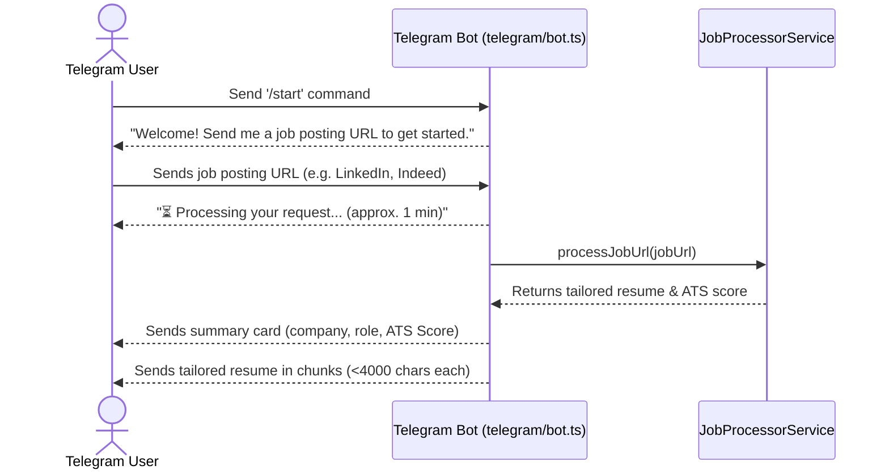
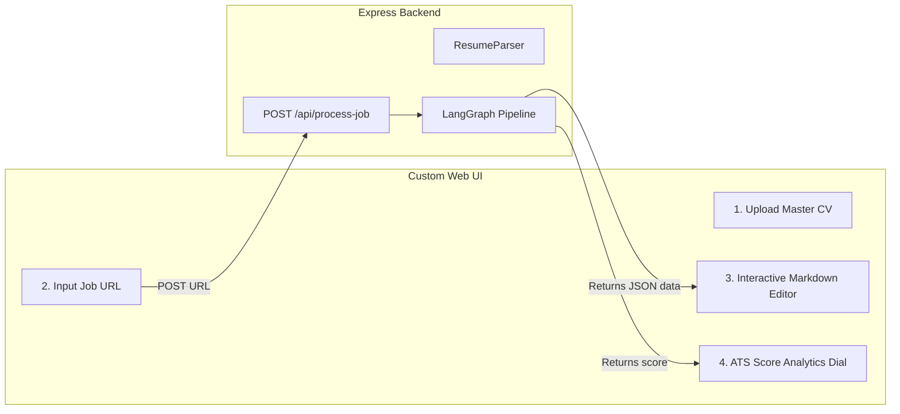

# Frontend Client Interface & API Hook

This document clarifies the client interfaces of the **AI Resume Tailor Bot**. While this repository is a backend-only application, it provides two user-facing interfaces: a primary **Telegram Chatbot Interface** and a **Headless REST API Endpoint** for external frontend integrations.

---

## 1. Primary Client: Telegram Chatbot Interface

The primary user interface is built on the Telegram platform using the `node-telegram-bot-api` library. Users interact with the bot in a conversational flow.



### Key Client Interactions:
1. **`/start` greeting**: Greets the user and gives quick instructions.
2. **Regex URL Filter**: Validates inputs using `/(https?:\/\/[^\s]+)/g` to ensure a URL was sent.
3. **Immediate Acknowledgement**: Sends a status update message ("⏳ Processing your request...") to manage expectations during the ~1-minute AI optimization process.
4. **Markdown Chunking & Fallback**:
   - The bot splits the final resume text into `4000`-character segments to stay safely under Telegram's `4096`-character message limit.
   - It attempts to send each segment with **Markdown parsing enabled** to render headings and bullets correctly.
   - If a segment contains invalid syntax, the bot catches the error and resends it as **plain text** to guarantee delivery.

---

## 2. Web Integration & Headless REST API

For developers building web-based interfaces (e.g. Next.js, React, Streamlit, or mobile apps), the application operates as a headless REST API.

Instead of routing through the Telegram client, external interfaces hit the endpoint directly:
`POST /api/process-job`

### Example Frontend Fetch Integration:

```javascript
// Example React / Vue frontend form submission handler
async function handleResumeTailoring(jobUrl) {
  try {
    const response = await fetch('http://localhost:3000/api/process-job', {
      method: 'POST',
      headers: {
        'Content-Type': 'application/json',
      },
      body: JSON.stringify({ url: jobUrl }),
    });

    const data = await response.json();

    if (data.success) {
      console.log('Target Role:', data.role);
      console.log('Target Company:', data.company);
      console.log('Estimated ATS Score:', data.atsScore);
      console.log('Tailored Markdown Resume:', data.tailoredResume);
      // Hydrate state to display markdown resume
    } else {
      console.error('Tailoring error:', data.error);
    }
  } catch (error) {
    console.error('Network failure:', error);
  }
}
```

---

## 3. Designing a Future Web Dashboard (Conceptual)

Integrating a custom React/Next.js dashboard with the API would extend the system's capabilities:



### Potential Frontend Improvements:
1. **Interactive Resume Uploads**: Replace the static master resume (`masterResume.md`) with a dynamic file upload interface.
2. **Surgical Diff Viewer**: Use a visual diff editor (like Monaco Editor or diff libraries) to highlight the edits made by the LangGraph optimizer.
3. **Download PDF / Docx**: Add options to export the tailored markdown resume directly to PDF or standard Word documents.
